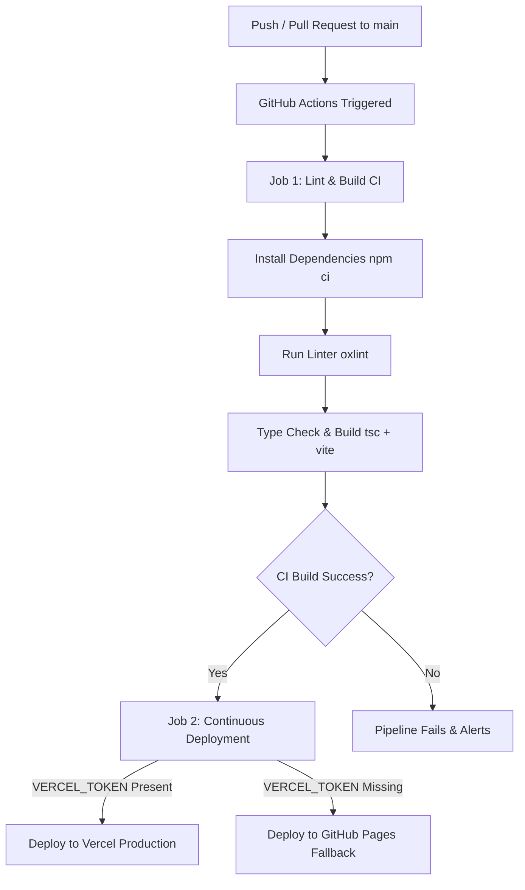

# 🚀 CI/CD Pipeline Guide

This repository is equipped with a complete Continuous Integration and Continuous Deployment (CI/CD) pipeline using **GitHub Actions**.

---

## 🛠️ Pipeline Architecture



---

## 📋 Features

1. **Automated Code Quality Checks**:
   - Runs `oxlint` on every push/PR to ensure strict code style and rule enforcement.
   - Runs TypeScript compilation check (`tsc -b`) to catch type errors before deployment.
2. **Automated Production Build**:
   - Bundles optimized frontend static assets into `dist/`.
   - Uploads build artifacts to GitHub Actions run outputs.
3. **Automated Deployment**:
   - **Vercel Deployment**: Primary deployment target (supports static React app + `api/contact.ts` serverless function).
   - **GitHub Pages Fallback**: Automatically deploys static assets to GitHub Pages if Vercel secrets are not configured.

---

## 🔑 Setting Up GitHub Repository Secrets

To enable automated production deployments and contact form email dispatching, set up the following secrets in your GitHub repository:

1. Navigate to your repository on GitHub: `https://github.com/ravichavan9970/Portfolio`
2. Go to **Settings** > **Secrets and variables** > **Actions**.
3. Click **New repository secret** and add the following keys:

| Secret Name | Required For | Description |
| :--- | :--- | :--- |
| `RESEND_API_KEY` | Contact Form API | Your Resend API key for sending email contact requests. |
| `VERCEL_TOKEN` | Vercel Deployment | Account token generated from [Vercel Account Settings > Tokens](https://vercel.com/account/tokens). |
| `VERCEL_ORG_ID` | Vercel Deployment | Found in your Vercel project `.vercel/project.json` or Organization settings. |
| `VERCEL_PROJECT_ID` | Vercel Deployment | Found in your Vercel project settings (**Project Settings > General > Project ID**). |

---

## ⚡ Triggering the Pipeline

- **Automatic Trigger on Code Push**: Any push to the `main` or `master` branch triggers full CI + CD deployment.
- **Pull Request Trigger**: Any PR targeting `main` or `master` triggers the `Lint & Build (CI)` job to verify code quality before merging.
- **Manual Trigger**: Go to the **Actions** tab on GitHub, select **CI/CD Pipeline**, and click **Run workflow**.

---

## 🐳 Docker Deployment (Optional)

If you prefer containerized deployment (e.g. AWS ECS, GCP Cloud Run, Docker Desktop, or VPS):

```bash
# Build the Docker image
docker build -t portfolio:latest .

# Run the container on port 80
docker run -d -p 80:80 --name portfolio-app portfolio:latest
```

Open your browser at `http://localhost` to view the running container.
