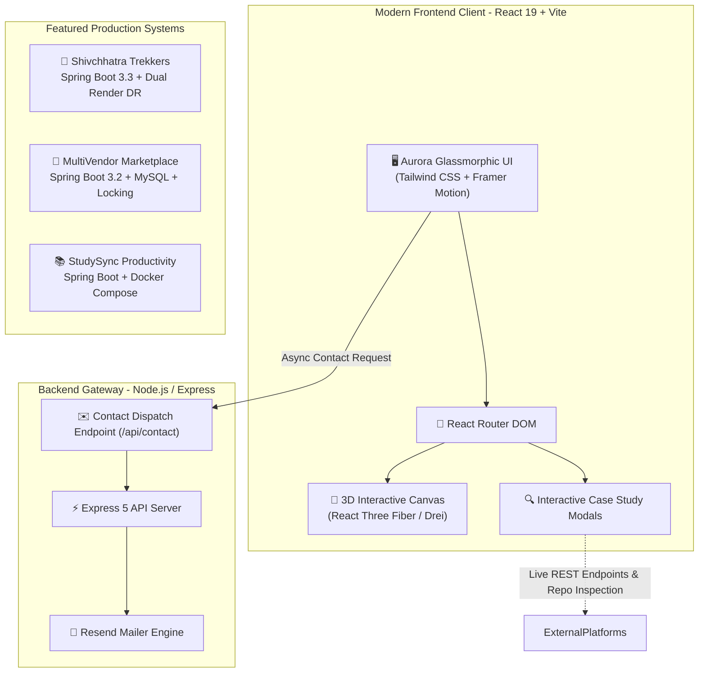
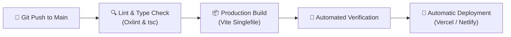

# 🚀 Ravindra Chavan — Enterprise Full Stack Developer Portfolio

<div align="center">

[](https://github.com/ravichavan9970/Portfolio.git)
[](https://github.com/ravichavan9970/Portfolio/actions/workflows/ci-cd.yml)
[](https://openjdk.org/)
[](https://spring.io/projects/spring-boot)
[](https://react.dev/)
[](https://www.typescriptlang.org/)
[](https://tailwindcss.com/)
[](LICENSE)

<br />

**Architecting High-Concurrency Java Microservices, Distributed Systems & Dual-Cloud Cloud Platforms**

[🌐 Explore Portfolio](https://portfolio-olive-three-73.vercel.app) • [💼 LinkedIn Profile](https://www.linkedin.com/in/ravindra-chavan-4ba744250/) • [📫 Contact Email](mailto:ravindrachavan265125@gmail.com) • [📄 Resume](Ravindra_Chavan_Resume%20.pdf)

</div>

---

## 📖 Table of Contents

- [Overview](#-overview)
- [🏛️ System Architecture](#️-system-architecture)
- [🚩 Flagship Engineering Projects](#-flagship-engineering-projects)
  - [1. Shivchhatra Trekkers (Enterprise Expedition & Disaster Recovery)](#1-shivchhatra-trekkers-enterprise-expedition--disaster-recovery)
  - [2. MultiVendor Marketplace (High-Concurrency Booking Engine)](#2-multivendor-marketplace-high-concurrency-booking-engine)
  - [3. StudySync (Student Productivity & Focus Platform)](#3-studysync-student-productivity--focus-platform)
- [🛠️ Technical Stack & Tooling](#️-technical-stack--tooling)
- [✨ Portfolio Core Capabilities](#-portfolio-core-capabilities)
- [📁 Repository Structure](#-repository-structure)
- [🚀 Getting Started & Local Setup](#-getting-started--local-setup)
- [🔄 CI/CD & Deployment Strategy](#-cicd--deployment-strategy)
- [📬 Contact & Connect](#-contact--connect)
- [📄 License](#-license)

---

## 🌟 Overview

Welcome to the official repository of **Ravindra Chavan's Full-Stack Engineering Portfolio**. 

Built with a high-performance **React 19 + TypeScript + Vite** frontend and an **Express.js API gateway**, this platform serves as an interactive case study hub showcasing enterprise-grade software projects, distributed backend architectures, high-concurrency race condition resolutions, and production-deployed cloud applications.

### 🎯 Key Highlights:
- ⚡ **Interactive Architecture Case Studies**: Tabbed deep-dives into real codebases, API controllers, database schemas, and disaster recovery replication engines.
- 🎨 **Aurora Glassmorphic UI & 3D Elements**: Dark modern interface built with Tailwind CSS, Framer Motion route transitions, and Three.js canvas components.
- 🛡️ **Zero-Downtime Deployment**: Continuous Integration & Delivery configured via GitHub Actions with multi-target deployment (Vercel & Netlify).
- 📧 **Direct API Email Dispatch**: Serverless backend integrating Resend for instantaneous contact form message delivery.

---

## 🏛️ System Architecture



---

## 🚩 Flagship Engineering Projects

### 1. Shivchhatra Trekkers (Enterprise Expedition & Disaster Recovery)
> **Production Master Expedition Booking & Dual-Cloud DR Engine**  
> 🌐 **Live Website**: [https://shivchhatra-trekkers.vercel.app](https://shivchhatra-trekkers.vercel.app) • 💻 **GitHub**: [SHIVCHHATRA_TREKKERS](https://github.com/ravichavan9970/SHIVCHHATRA_TREKKERS.git)

- **Tech Stack**: Java 21 LTS, Spring Boot 3.3.3, React 19, Spring Data JPA, Hibernate, H2 Disk Persistent Database, Docker, Tailwind CSS, Vite.
- **Enterprise Features**:
  - **🛡️ 1-Click Dual-Cloud Disaster Recovery**: Atomic bulk-sync endpoints (`/api/admin/system/full-export`, `/api/admin/system/full-import`) enabling seamless 1-click cloud-to-cloud replication between Primary and Secondary Render instances.
  - **💳 Dynamic UPI QR & 12-Digit UTR Bank Auditor**: Dynamic merchant scanner generator with image receipt uploads, UTR reference validation, and instant confirmation workflow.
  - **🎫 Real-Time Boarding Pass Tracker (`/track`)**: Live status polling, WhatsApp lead integration, and printable boarding passes.
  - **🏛️ Sacred Forts Heritage Guide**: Interactive encyclopedic directory covering iconic Maratha forts with elevations, bastions, and historical narratives.
  - **💾 High-Volume CLOB Storage**: JPA `@Lob CLOB` architecture supporting up to 50MB base64 media uploads.

---

### 2. MultiVendor Marketplace (High-Concurrency Booking Engine)
> **Enterprise Multi-Vendor Platform with Pessimistic Locking & Hold Daemons**  
> 💻 **GitHub**: [MultiVendor](https://github.com/ravichavan9970/MultiVendor.git)

- **Tech Stack**: Java 21 LTS, Spring Boot 3.2.5, Spring Security JWT, Spring Data JPA, MySQL 8.0, React, Docker.
- **Enterprise Features**:
  - **⏱️ 10-Minute Hold Reservation Daemons**: Background `@Scheduled` tasks automatically releasing unpaid held slots without blocking the database.
  - **🔒 Pessimistic Database Locking**: Prevents overbooking and concurrent race conditions across simultaneous booking transactions under high traffic.
  - **🔐 Dual-Identifier 6-Digit OTP Auth**: Secure multi-channel authentication (Email & SMS) with BCrypt hashing and stateless JWT tokens.
  - **📊 Vendor Hub Analytics**: Automated revenue calculations, batch slot generator, and instant payment receipt modals.

---

### 3. StudySync (Student Productivity & Focus Platform)
> **Microservice-Ready Student Task & Pomodoro Command Center**  
> 💻 **GitHub**: [StudySync](https://github.com/ravichavan9970/StudySync.git)

- **Tech Stack**: Java 21 LTS, Spring Boot 3, Spring Security, React, Docker Compose, MySQL 8.0, Chart.js, OpenAPI/Swagger.
- **Enterprise Features**:
  - **⚡ 30+ RESTful APIs across 7 Modules**: Authentication, Tasks, Notes, Planner, Focus Room, and Analytics built with clean controller-service-repository patterns.
  - **⏱️ Pomodoro Timer & Chart.js Metrics**: Tab-synchronized focus timer using Web Workers with weekly productivity trend charts.
  - **🗄️ Normalized 7-Table Relational Schema**: Indexed lookup queries for sub-millisecond retrieval of user tasks and streak history.
  - **🐳 1-Command Docker Compose**: Containerized multi-container orchestration for instant local and cloud deployment.

---

## 🛠️ Technical Stack & Tooling

| Domain | Technologies & Libraries |
|---|---|
| **Backend & Architecture** | Java 21 LTS, Spring Boot 3.3/3.2, Spring Security, JWT, Spring Data JPA, Hibernate, Express 5, Node.js |
| **Frontend Frameworks** | React 19, TypeScript 5, Vite 8, React Router DOM 7, Singlefile Plugin |
| **Styling & UI Effects** | Tailwind CSS 4, Framer Motion 12, Lucide Icons, React Icons, Three.js, React Three Fiber |
| **Databases & Persistence** | MySQL 8.0, H2 Embedded Database (Disk Mode), Hibernate ORM, Relational Indexing |
| **Containerization & CI/CD** | Docker, Docker Compose, GitHub Actions, Vercel, Netlify |
| **Tooling & Code Quality** | Apache Maven 3.9, Oxlint, npm, Postman, OpenAPI / Swagger |

---

## ✨ Portfolio Core Capabilities

- **Interactive Project Spotlights**: Detailed multi-tab interactive previews showing live application UIs, operations centers, solved engineering challenges, and architectural roadmaps.
- **2026 Developer Roadmap**: Chronological vertical timeline outlining academic foundations (B.Sc. & M.Sc. CS) through enterprise full-stack development.
- **Live Search & Filter Matrix**: Instant multi-criteria keyword and technology search across all verified projects.
- **Live GitHub Profile & Repository Sync**: Real-time caching integration fetching public repository statistics and starred repositories.
- **Recruiter-Focused Overview**: Dedicated breakdown of core engineering specializations, backend design principles, and enterprise capabilities.

---

## 📁 Repository Structure

```text
Ravi-Portfolio-main/
├── .github/
│   └── workflows/
│       └── ci-cd.yml                 # Automated GitHub Actions CI/CD Pipeline
├── backend/
│   └── server.js                     # Express API gateway with Resend integration
├── public/                           # Static assets, icons, and audio files
├── src/
│   ├── assets/                       # High-res project screenshots, mockups & logo
│   │   ├── shivchhatra-1.png         # Shivchhatra Public Portal
│   │   ├── shivchhatra-2.png         # Shivchhatra Operations Hub
│   │   ├── multivendor-1.png         # MultiVendor Marketplace
│   │   ├── multivendor-2.png         # MultiVendor Vendor Hub
│   │   ├── studysync-1.png           # StudySync Dashboard
│   │   └── studysync-2.png           # StudySync Focus Room
│   ├── components/
│   │   ├── AnimatedRole.tsx          # Dynamic typewriter role rotator
│   │   ├── Avatar.tsx                # Profile visual component
│   │   ├── Footer.tsx                # Global footer & quick links
│   │   ├── Navbar.tsx                # Glassmorphic header & navigation
│   │   ├── ProjectModal.tsx          # Deep-dive case study modal dialog
│   │   ├── SEO.tsx                   # Dynamic meta tags & SEO optimizer
│   │   └── SplashScreen.tsx          # Initial load transition
│   ├── pages/
│   │   ├── AboutPage.tsx             # Bio, education & 3D floating stack
│   │   ├── CertificationsPage.tsx    # Technical credentials & certificates
│   │   ├── ContactPage.tsx           # Contact form & direct social links
│   │   ├── Home.tsx                  # Flagship landing page & timeline
│   │   ├── JourneyPage.tsx           # Vertical 2026 development roadmap
│   │   ├── ProjectsPage.tsx          # Flagship spotlight & searchable grid
│   │   ├── ServicesPage.tsx          # Core engineering service offerings
│   │   └── SkillsPage.tsx            # Comprehensive tooling matrix
│   ├── services/
│   │   └── githubService.ts          # Cached GitHub REST API client
│   ├── App.tsx                       # Master routing & theme providers
│   ├── index.css                     # Aurora styling & custom Tailwind classes
│   └── main.tsx                      # React root entry
├── .gitignore                        # Git exclusion rules (credentials, dist, node_modules)
├── Dockerfile                        # Multi-stage Docker production image
├── netlify.toml                      # Netlify build & redirect routing
├── package.json                      # NPM dependencies & workspace scripts
├── README.md                         # Comprehensive repository documentation
├── tsconfig.json                     # TypeScript compiler configuration
├── vercel.json                       # Vercel SPA routing & cache headers
└── vite.config.ts                    # Vite 8 build & singlefile plugins
```

---

## 🚀 Getting Started & Local Setup

### 📋 Prerequisites
- **Node.js**: `v18.0.0` or higher ([Download Node.js](https://nodejs.org/))
- **npm**: `v9.0.0` or higher
- **Git**: Installed and configured

---

### 1️⃣ Clone the Repository
```bash
git clone https://github.com/ravichavan9970/Portfolio.git
cd Portfolio
```

---

### 2️⃣ Install Dependencies
```bash
npm install
```

---

### 3️⃣ Configure Environment Variables
Create a `.env` file in the root directory (refer to `.env.example`):
```env
# Server Configuration
PORT=5000

# Resend API Key (for contact form email delivery)
RESEND_API_KEY=your_resend_api_key_here
CONTACT_RECEIVER_EMAIL=ravindrachavan265125@gmail.com
```

---

### 4️⃣ Start Development Server
```bash
# Starts both Express backend and Vite client concurrently
npm run dev
```
- 🌐 Client App: **`http://localhost:5173`**
- ⚡ Backend API: **`http://localhost:5000`**

---

### 5️⃣ Production Build
```bash
npm run build
```
Generates an ultra-optimized production build in `dist/`.

---

## 🔄 CI/CD & Deployment Strategy

This repository employs an automated Continuous Integration & Continuous Delivery workflow:



- **GitHub Actions Workflow**: Runs on every push and pull request targeting `main`.
- **Zero Downtime**: Automated preview branches and instant production promotion.
- **Asset Inlining**: Optimized bundling for instant page loads and zero bundle waterfalls.

---

## 📬 Contact & Connect

I am actively seeking **Java Full-Stack / Backend Software Engineer** opportunities in Pune, Maharashtra, and across India. Let's discuss how my backend and distributed system skills can add value to your team!

<div align="center">

[](https://www.linkedin.com/in/ravindra-chavan-4ba744250/)
[](https://github.com/ravichavan9970)
[](mailto:ravindrachavan265125@gmail.com)
[](https://www.instagram.com/ravi_chavan_2002)

</div>

---

## 📄 License

Distributed under the **MIT License**. See `LICENSE` for more information.

---

<div align="center">
  <sub>Built with ❤️ by <b>Ravindra Chavan</b> • © 2026 All Rights Reserved</sub>
</div>
